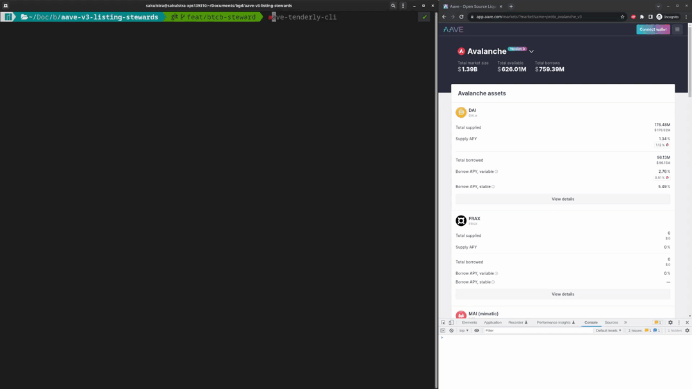

# Aave tenderly cli

`aave-tenderly-cli` is a cli package meant to be installed globally so you can simply reuse it in various projects to test things on the production ui. Each command will print out instructions to hook up the ui appropriately so you can run the ui against your newly created fork.



## Installation

```sh
npm i -g @bgd-labs/aave-tenderly-cli
```

## Setup env

The tooling relies on tenderly. Therefore you need to setup your console environment accordingly.

```sh
export TENDERLY_ACCESS_TOKEN=tenderly_access_token
export TENDERLY_PROJECT=tenderly_project
export TENDERLY_ACCOUNT=tenderly_account
```

To store the secrets across sessions you might want to add them to `.bashrc` or `.profile`.

## Usage

```sh
# help command
aave-tenderly-cli --help
```

## Examples

**Simple fork**

To create a fork of the aave polygon market you can simply run `aave-tenderly-cli fork --networkId 137`

**Execute pending proposal**

To review the effects of a proposal before it's executed onchain you can simply run `aave-tenderly-cli gov --proposalId 95`.

**Execute proposal payload**

To execute a deployed payload just run `aave-tenderly-cli gov --payloadAddress 0xb8fe2a2104afb975240d3d32a7823a01cb74639f`.

**Execute local proposal payload**

To review effects of a local proposalPayload you can run `aave-fork-cli fork --artifact ./out/FeiRiskParamsUpdate.sol/FeiRiskParamsUpdate.json` where `--artifact` needs to be the relative path to the `PayloadArtifact` that you want to execute.

All these commands will yield instructions on how to setup the aave interface to run against your fork.

```txt
To use this fork on the aave interface you need to do the following things.

1. Open the browser console on app.aave.com (or a local instance) and enter
--------------
localStorage.setItem('forkEnabled', 'true');
localStorage.setItem('forkBaseChainId', 1);
localStorage.setItem('forkNetworkId', 3030);
localStorage.setItem("forkRPCUrl", "https://rpc.tenderly.co/fork/id");
--------------
2. As localStorage is not observable you need to reload now.
3. You can now see & select forked mainnet markets on the ui.
To interact with them you still need to setup your wallet.
To setup your wallet you need to add a network with:
--------------
networkId: 3030
rpcUrl: https://rpc.tenderly.co/fork/id
--------------

warning: the fork will be deleted once this terminal is closed
Proposal executed
```

## Local Development

```sh
npm run publish:local
```
